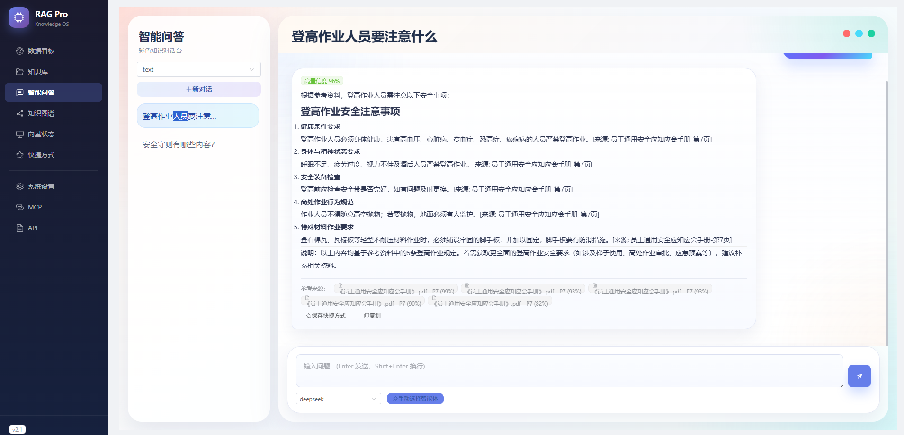
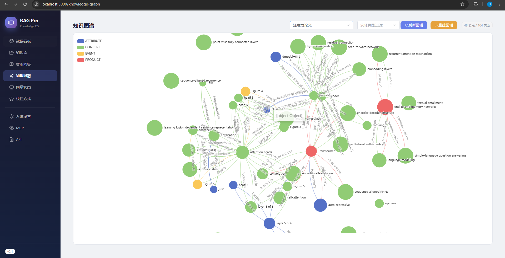

# RAG Pro v2.1

企业级知识库检索增强生成系统 — **HNSW + BM25 + RRF 混合检索 × Neo4j 知识图谱 × 多智能体输出**

---

## 项目预览

| 智能问答 | 知识图谱 |
|:---:|:---:|
|  |  |

---

## 环境准备

### 系统要求

| 组件 | 版本 | 说明 |
|------|------|------|
| Python | 3.10+ | 后端运行 |
| Node.js | 18+ | 前端构建 |
| Docker Desktop | 任意 | Neo4j 图数据库 |
| Git | 任意 | 代码管理 |

### 安装

```bash
git clone https://github.com/studyyyyyyyy-cn/RAG.git
cd RAG

# 后端
cd backend
python -m venv venv
venv\Scripts\activate
pip install -r requirements.txt

# 前端
cd ../frontend
npm install
```

---

## 启动

双击项目根目录 `start.bat`，自动完成：
1. 清理旧进程和锁文件
2. 启动 Neo4j（Docker）
3. 启动后端 API（`localhost:8000`）
4. 启动前端（`localhost:5173`）

或手动：
```bash
docker-compose up -d neo4j          # Neo4j
cd backend && venv\Scripts\python.exe -m uvicorn app.main:app --host 0.0.0.0 --port 8000 --reload
cd frontend && npx vite --host 0.0.0.0
```

| 服务 | 地址 |
|------|------|
| 前端 | http://localhost:5173 |
| API 文档 | http://localhost:8000/docs |
| 知识图谱 | http://localhost:5173/knowledge-graph |
| 向量状态 | http://localhost:5173/vector-status |
| Neo4j | http://localhost:7474 |

---

## 项目结构

```
RAG-Pro/
├── backend/app/
│   ├── agents/          # 6 种智能体（文本/图表/报表/网页/数据/图谱）
│   ├── api/v1/          # REST API（知识库/文档/问答/Agent/图谱/向量状态）
│   ├── core/            # 核心引擎
│   │   ├── vector_store.py    # 向量存储 + HNSW+BM25+RRF 检索
│   │   ├── embedder.py        # BGE-M3 / MiniLM / OpenAI 嵌入层
│   │   ├── retriever.py       # 双路检索（文档向量 + 图谱实体）
│   │   ├── reranker.py        # BGE-Reranker 重排序
│   │   ├── chunker.py         # 9 种分块策略
│   │   ├── graph_store.py     # Neo4j 图数据库
│   │   ├── graph_builder.py   # 文档 → 实体抽取 → 图构建
│   │   ├── entity_extractor.py # LLM 实体关系抽取
│   │   ├── graph_to_vector.py # 图谱节点/边 → embedding
│   │   └── exceptions.py      # 异常体系（10+ 种）
│   ├── models/          # SQLAlchemy 数据模型
│   └── mcp/             # MCP 协议支持
├── frontend/src/
│   ├── views/           # 8 个页面（看板/知识库/问答/图谱/向量/快捷/设置）
│   └── components/      # 消息/图表/报表/引用渲染
├── docs/                # 架构/入门/MCP 文档
├── docker-compose.yml   # Neo4j + PostgreSQL + Redis + Milvus
└── start.bat            # 一键启动
```

---

## 功能实现

### 混合检索

HNSW 索引（余弦相似度）+ BGE-M3 BM25 关键词 → RRF 融合 → BGE-Reranker 精排

### 知识图谱

LLM 抽取实体关系 → Neo4j 图存储 → 节点/边向量化 → 独立图谱检索 → 1-hop 邻居上下文注入 Prompt

### 多智能体

LLM 意图检测 → 路由到 6 种 Agent → 前端按 type 分发渲染（图表/报表/网页/图谱/表格/文本）

### 向量状态监控

每 KB 实时显示 chunk 向量/图谱向量/Neo4j 节点/边数量 → SSE 流式一键重载

### MCP 集成

符合 MCP 2024-11-05 协议，SSE + JSON-RPC，供 Claude Desktop 等外部客户端调用

---

## 技术原理

```
用户提问
  ↓ BGE-M3 Embedding (1024维)
  ├─→ 文档检索: HNSW + BM25 → RRF → top-5 chunk → 【参考资料】
  └─→ 图谱检索: 最佳实体 → Neo4j 邻居+属性 → 【知识图谱上下文】
  ↓
  合并 → Prompt → LLM → 回答
```

---

## 首次使用

1. **系统设置** → 添加 LLM（如 DeepSeek: `deepseek-chat`）
2. **知识库** → 创建 KB → 上传文档 → 执行分块
3. **向量状态** → 点"重载"确认向量入库
4. **知识图谱** → 点"重建图谱"抽取实体关系
5. **智能问答** → 提问测试

---

## 版本

| 版本 | 主要变更 |
|------|----------|
| v1.0 | 基础 RAG + 多智能体 + MCP |
| v2.0 | Neo4j 知识图谱 + 向量状态仪表盘 |
| v2.1 | HNSW+BM25+RRF + 双路图谱 + 前端重设计 |

## License

MIT
